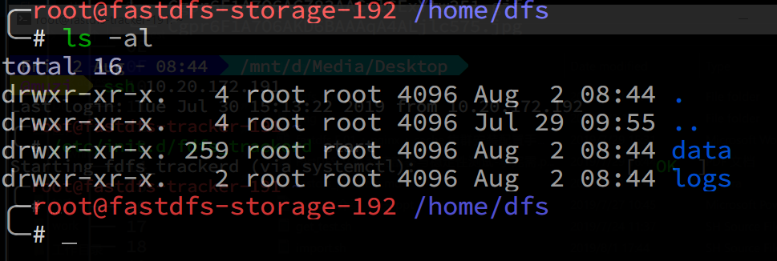
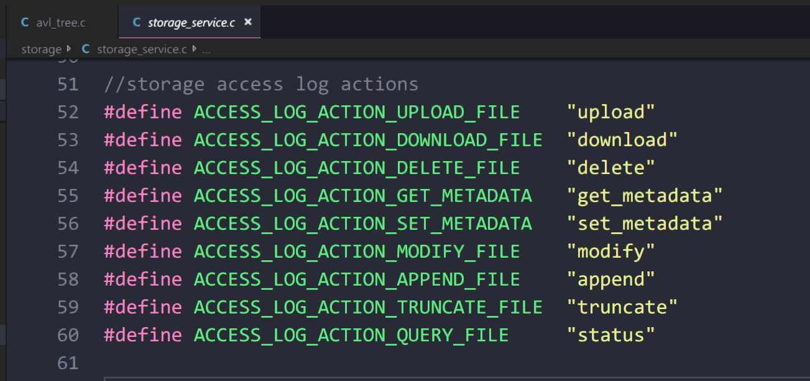

# Lua + Redis 对 nginx 做动态路由

## 0.项目背景

由于 FastDFS 分布式文件存储在上传文件时不保留原文件名，当上传完文件后会返回如下面格式的文件 ID。在文件 ID 中包含了文件所在的组，二级目录，以及由客户端 IP 、时间戳、文件大小生成的 base64 编码文件名。客户端数据库里存储这个着文件 ID ，且只能通过文件 ID 来访问获取文件。如果其他系统想要访问 FastDFS 文件存储就必须从上传客户端保存的数据库中获取该文件的文件 ID 。这样增加了系统的耦合程度，也不利于后续文件存储的迁移和运维。由于 FastDFS 是将文件直接存放在本地磁盘，并不对文件进行分块、合并操作，所以我们可以直接让 nginx 去请求获取本地磁盘上的文件，不经过查询客户端数据库获取文件 ID，无需经过 FastDFS 也可以获取到文件。

**文件 ID 的组成**


`group1` 是文件所在组名

`M00` 是文件所在的 storage 服务器上的分区

 `00/05` 就是文件所在的一级子目录/二级子目录，是文件所在的真实路径

`Cgpr6F1A7O6ASWv9AAA-az6haWc850.jpg` 是新生成的文件名

**文件存储的根目录，由 `base_path=` 配置参数设定，data 目录为文件存储目录，logs 目录存储日志**



**文件存储的一级子目录**


**文件存储的二级子目录**


**FastDFS 存储真实的文件，不对文件做分块、合并**


**为方便测试，在这里打开了 `nginx` 列出目录选项**


##   实现过程

##  1. 获取原文件名和新生成的文件 ID

在客户端(C语言版)的日志中提取出以下格式的日志，其他版本的客户端可以在数据库中获取，该日志记录了原文件名和上传后由 FastDFS 存储服务生成的文件 ID 。


需要在原文件名前加上一个 ```/``` 作为 请求的 `uri`头 ,转换后的格式如下


### 2. 将数据导入 Redis

使用 shell 脚本将原文件名（也可以自定义）作为 KEY ，文件 ID 为 VALUE 导入  Redis  数据库

`awk 'BEGIN{ FS=" "}{arr[$NF]=$1}END{for( k in arr){ cmd=d="redis-cli set "k" "arr[k];system(cmd)}}' url.log`

```bash
# 通过脚本导入
#!/bin/bash
# import data
cat $1 | while read line
do
    key=$(echo $line | cut -d ' ' -f2)
    value=$(echo $line | cut -d ' ' -f1)
    redis-cli set $key $value 
done
```

```ini
# 10W 条 K/V 键值对占用不到15MB 内存
╭─root@ubuntu-238 /tmp
╰─# redis-cli
127.0.0.1:6379> info
# Memory
used_memory:14690296
used_memory_human:14.01M
used_memory_rss:18280448
used_memory_rss_human:17.43M
used_memory_peak:18094392
used_memory_peak_human:17.26M
used_memory_peak_perc:81.19%
used_memory_overhead:5881110
used_memory_startup:782504
used_memory_dataset:8809186
used_memory_dataset_perc:63.34%
total_system_memory:4136931328
total_system_memory_human:3.85G
used_memory_lua:37888
used_memory_lua_human:37.00K
maxmemory:0
maxmemory_human:0B
maxmemory_policy:noeviction
mem_fragmentation_ratio:1.24
mem_allocator:jemalloc-3.6.0
active_defrag_running:0
lazyfree_pending_objects:0

127.0.0.1:6379> get /000001.jpg
"group1/M00/00/05/Cgpr6F1A6oOARgfgAAAdDglAWL4368.jpg"
127.0.0.1:6379>
```


### 3. 编译 nginx 加入 lua 和 lua-Redis 模块

**3.1.1 编译环境** 

```
yum install -y gcc g++ gcc-c++  zlib zlib-devel openssl openssl--devel pcre pcre-devel
```

**3.1.2 编译 luajit**

```shell
# 编译安装 luajit
wget http://luajit.org/download/LuaJIT-2.1.0-beta2.tar.gz
tar zxf LuaJIT-2.1.0-beta2.tar.gz
cd LuaJIT-2.1.0-beta2
make PREFIX=/usr/local/luajit
make install PREFIX=/usr/local/luajit
```

**3.1.3 下载 ngx_devel_kit（NDK）模块**

```shell
wget https://github.com/simpl/ngx_devel_kit/archive/v0.2.19.tar.gz
tar -xzvf v0.2.19.tar.gz
```

**3.1.4 下载 lua-nginx-module 模块**

```shell
wget https://github.com/openresty/lua-nginx-module/archive/v0.10.2.tar.gz
tar -xzvf v0.10.2.tar.gz
```

**3.1.5 编译 nginx**

```shell
tar zxvf nginx-1.15.1.tar.gz
cd nginx-1.15.1/

# tell nginx's build system where to find LuaJIT 2.1:
export LUAJIT_LIB=/usr/local/luajit/lib
export LUAJIT_INC=/usr/local/luajit/include/luajit-2.1

./configure --prefix=/usr/local/nginx --with-ld-opt="-Wl,-rpath,/usr/local/luajit/lib" --with-http_stub_status_module --with-http_ssl_module --with-http_realip_module --with-http_gzip_static_module --with-debug \
--add-module=/usr/local/src/nginx_lua_tools/ngx_devel_kit-0.2.19

# 重新编译
./configure (之前安装的参数) --with-ld-opt="-Wl,-rpath,/usr/local/luajit/lib" --add-module=/path/to/ngx_devel_kit --add-module=/path/to/lua-nginx-module
--add-module后参数路径根据解压路径为准
make -j4 & make install
# --with-debug "调试日志"默认是禁用的，因为它会引入比较大的运行时开销，让 Nginx 服务器显著变慢。
# 启用 --with-debug 选项重新构建好调试版的 Nginx 之后，还需要同时在配置文件中通过标准的 error_log 配置指令为错误日志使用 debug 日志级别（这同时也是最低的日志级别）
```

### 4. 配置 nginx

```ngin
server {
    listen 80;
    
    location ~/group[0-9]/ {
    autoindex on;
    root /home/dfs/data;
    }

    location = /Redis {
        internal;
        set_unescape_uri $key $arg_key;
        Redis2_query get $key;
        Redis2_pass 127.0.0.1:6379;
    }
# 此处根据业务的需求来写正则表达式，一定要个 redis 里的 KEY  对应上
    location  ~/[0-9].*\.(gif|jpg|jpeg|png)$ {
        set $target '';
        access_by_lua '
# 使用 nginx 的内部参数 ngx.var.uri 来获取请求的 uri 地址，如 /000001.jpg 
            local key = ngx.var.uri
# 根据正则匹配到 KEY ，从 redis 数据库里获取文件 ID (路径和文件名)
            local res = ngx.location.capture(
                "/Redis", { args = { key = key } }
            )
            if res.status ~= 200 then
                ngx.log(ngx.ERR, "Redis server returned bad status: ",
                    res.status)
                ngx.exit(res.status)
            end
            if not res.body then
                ngx.log(ngx.ERR, "Redis returned empty body")
                ngx.exit(500)
            end
            local parser = require "Redis.parser"
            local filename, typ = parser.parse_reply(res.body)
            if typ ~= parser.BULK_REPLY or not server then
                ngx.log(ngx.ERR, "bad Redis response: ", res.body)
                ngx.exit(500)
            end

            ngx.var.target = filename
        ';
        proxy_pass http://10.20.172.196/$target;
    }
}
```


### 5. 测试访问

**5.1.1 拼接图片文件的 `url` 地址**


**5.1.2 通过浏览器访问**


**5.1.3 使用 wget 和 xargs 并行下载**


### 6. 不足和改进方案

**优势**

此方案的好处就是可以从过自定义访问的文件名来获取已经上传的文件，自定义的文件名根据业务的需求来设定。在 nginx location 模块写相应的正则表达式。从而将 FastDFS 与上传客户端解耦，使得访问文件无需依赖 FastDFS 存储，减少运维成本。同时由于使用的是 Redis 数据库和内部转发，对访问的客户端来说是透明的，性能损耗几乎可以忽略不计。

**6.1 不足**

1. 由于 Redis 数据库里的数据需要从客户端日志或数据库中导入，所以无法对 Redis 数据库进行实时更新，如果对上传后的文件进行了修改或删除操作，无法更新到 Redis 数据库中。
2. 需要重新编译安装 nginx 加入 lua-nginx 模块、还需要安装 Redis 数据库

**6.2 改进**

1. 修改 FastDFS 日志输出的内容，添加元文件名字段，根据日志的操作记录对 Redis 进行增删改查

	通过源码可知，FastDFS 在日志中记录了文件的操作类型，可以根据这些类型对 Redis 数据库进行增删改查，从而可以监控日志的而输出来对 Redis 数据库进行增删改查。

	```c
	//storage access log actions
	#define ACCESS_LOG_ACTION_UPLOAD_FILE    "upload"
	#define ACCESS_LOG_ACTION_DOWNLOAD_FILE  "download"
	#define ACCESS_LOG_ACTION_DELETE_FILE    "delete"
	#define ACCESS_LOG_ACTION_GET_METADATA   "get_metadata"
	#define ACCESS_LOG_ACTION_SET_METADATA   "set_metadata"
	#define ACCESS_LOG_ACTION_MODIFY_FILE    "modify"
	#define ACCESS_LOG_ACTION_APPEND_FILE    "append"
	#define ACCESS_LOG_ACTION_TRUNCATE_FILE  "truncate"
	#define ACCESS_LOG_ACTION_QUERY_FILE     "status"
	```

2. 仔细阅读了 FastDFS  storage 模块的源代码后发现， FastDFS 服务端是不保存原文件名的，而且在相应的文件属性结构体里也未包含原文件名。需要修改源码才能将原文件名输出到日志，难度较大。

```C
typedef struct
{
	bool if_gen_filename;	  //if upload generate filename
	char file_type;           //regular or link file
	bool if_sub_path_alloced; //if sub path alloced since V3.0
	char master_filename[128];
	char file_ext_name[FDFS_FILE_EXT_NAME_MAX_LEN + 1];
	char formatted_ext_name[FDFS_FILE_EXT_NAME_MAX_LEN + 2];
	char prefix_name[FDFS_FILE_PREFIX_MAX_LEN + 1];
	char group_name[FDFS_GROUP_NAME_MAX_LEN + 1];  	//the upload group name
	int start_time;		//upload start timestamp
	FDFSTrunkFullInfo trunk_info;
	FileBeforeOpenCallback before_open_callback;
	FileBeforeCloseCallback before_close_callback;
} StorageUploadInfo;

typedef struct
{
	char op_flag;
	char *meta_buff;
	int meta_bytes;
} StorageSetMetaInfo;

typedef struct
{
	char filename[MAX_PATH_SIZE + 128];  	//full filename
	/* FDFS logic filename to log not including group name */
	char fname2log[128+sizeof(FDFS_STORAGE_META_FILE_EXT)];
	char op;            //w for writing, r for reading, d for deleting etc.
	char sync_flag;     //sync flag log to binlog
	bool calc_crc32;    //if calculate file content hash code
	bool calc_file_hash;      //if calculate file content hash code
	int open_flags;           //open file flags
	int file_hash_codes[4];   //file hash code
	int64_t crc32;            //file content crc32 signature
	MD5_CTX md5_context;
	union
	{
		StorageUploadInfo upload;
		StorageSetMetaInfo setmeta;
	} extra_info;
	int dio_thread_index;		//dio thread index
	int timestamp2log;		//timestamp to log
	int delete_flag;     //delete file flag
	int create_flag;    //create file flag
	int buff_offset;    //buffer offset after recv to write to file
	int fd;         //file description no
	int64_t start;  //the start offset of file
	int64_t end;    //the end offset of file
	int64_t offset; //the current offset of file
	FileDealDoneCallback done_callback;
	DeleteFileLogCallback log_callback;

	struct timeval tv_deal_start; //task deal start tv for access log
} StorageFileContext;
```

**通过 FastDFS 日志记录的文件操作类型来实时更新 Redis 数据库**



